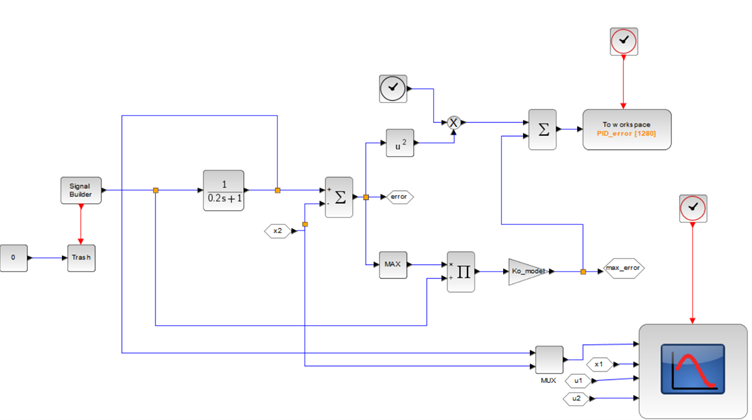
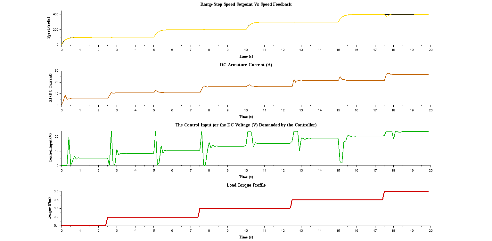
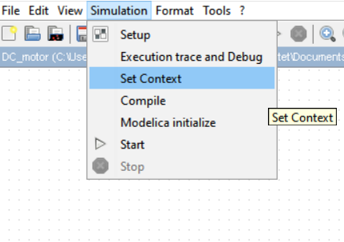

# Genetic Algorithm-Based PID Tuner for a Simple DC Motor

# Description

### The Optimizer 
This is my trial of a genetic algorithm based PID tuner for models designed using Scilab/Xcos.

The genetic algorithm function used is the **optim_ga** from Scilab. For this project, the following parameters were defined: the population size, the number of generations, the mutation probability, the crossover probability, the number of couples, the bounds of the parameters, and their dimensions.

### The Xcos Model
In the Xcos file, the DC motor is modelled using a state-space representation as illustrated below:
**The electrical equation**
$$v_{DC}(t) = i(t)R + L\dot{i(t)} + \epsilon_a$$
Where $v_{DC}(t)$ is the DC-link voltage, $i(t)$ is the armature current, $\epsilon_a$ is back-emf voltage = $K_b*\omega$ where $K_b$ is the BEMF constant, and $\omega$ is the rotor's speed.
 
 **The Mechanical Equation**
 $$T_m - T_L = J\dot{\omega} + B\omega$$

Where $T_m$ is the motor's electromagnetic torque = $K_ti(t)$,where $K_t$ is the motor's Torque constant. Likewise, $T_L$ is the load torque, $J$ is the rotor's inertia, and $B$ is the viscous friction damping coefficient.

**State-Space Representation**

Let $x_1$ = $i(t)$, $x_2$ = $\omega$, $u_1$ = $v_{DC}(t)$, and $u_2$ = $T_L$
$$\dot{x_1} = -\frac{x_1R}{L} - \frac{K_bx_2}{L} + \frac{u_1}{L}$$
$$\dot{x_2} = \frac{K_tx_1}{J} - \frac{Bx_2}{J} - \frac{u_2}{J}$$

$$y = x_2$$

**The PID controller**

In the S-domain, the control input is defined as:
$$U(s) = K_pE(s) + \frac{K_i}{s} + \frac{sK_d}{T_cs+1}$$

**The error function used for the cost function**

$$\sum_{i=o}^{n}[t_ie_i^2 + K_o\frac{e_i}{ref}]$$

The implementation of this in Xcos is shown in figure below 
Where $n$ $K_o$ is the weight on the ratio between ${e_i}$ and ${ref}$, the ratio is between the error and the reference signal and it is meant to be a measure of the overshoot.

## Scilab/Xcos Implementation
This systems were developed in Xcos and Scilab and the results are shown below:

## Practicalities

The setpoint is a series of step signals, but I smoothened the edges of these signals by passing them through a low-pass filter, which would allow the control system to gradually follow the reference, hence reducing the amount of overshoot caused by sudden step changes.

Another benefit of these setpoint filtering for a real practical DC motor is that can cause overcurrent and destroy the motor windings.

Furthermore, I passed in a load torque which is a series of step signals as the second input to the system. Practically, your DC motor will have a certain amount of load torque it can support when maintaining a certain speed--especially if it is in a constant power operation $MechanicalPower  = Torque * speed$. However, you might need to simply increase the saturation limit on the control input, which would allow the controller produce more DC voltage required to accelerate the rotor's speed to a higher setpoint or support a higher load torque.

## How to use
1. Download and save all the files into the same folder
2. Run the **tuning_script.sce**, this will run the tuning process. The number of iterations is set by the variable **$NbGen$** and the number of computations per iteration is **$NbGen*dimensions$**.
3. After it has finished running, then run the **running_script.sce**
4. If you wish to modify the DC motor's parameters to suit your application, the parameters are defined in the **Set Context** tab as shown in figure below 
5. If you change the simulation time in the Xcos file, please kindly change the simulation time in the **tuning_script.sce** and **running_script.sce** by changing the **sim_time** variable.